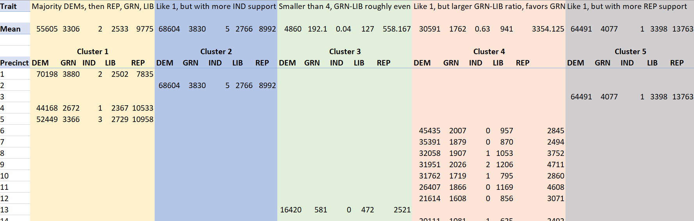

# Baltimore-City-Party-Votes-by-Precinct

## Background

This project aims to study how each precinct in Baltimore city votes using data from 2016 elections. The data looks at counts of votes for each candidate and their political party. A cluster analysis was applied via Excel to divide the precincts into groups of similar voting preferences. Like Maryland, Baltimore is generally accepted as a more liberal/left-leaning location that tends to support the Democratic party, so this is a matter of seeing how precincts differ in terms of support across the board.

### Display of clusters (does not show all 67)

As seen in the image, these are the 5 clusters with different traits. Clusters are affected by different precincts' support for third-party candidates.

## Data and Information Sources

1) [Maryland State Board of Elections](https://elections.maryland.gov/elections/2016/election_data/index.html).

## Data Analysis

We will look at:

1) What the clusters themselves are

2) What sets them apart

## Data Manipulation

The following methods and commands were used:

1) Data summary: MIN (to find SSE) - MIN + range > OK

2) Used MATCH to determine which cluster each precinct belongs in via its minimum - MATCH + item to match (MIN) + range > OK

3) Used IF to display data for each cluster - if precinct is in this cluster, then print data

3) Used Solver tool to minimize SSE and identify most accurate cluster anchors - Data tab > Solver

4) Used HLOOKUP to consolidate anchors - VLOOKUP + cell to look up + table to look in + row/column to look in > OK
